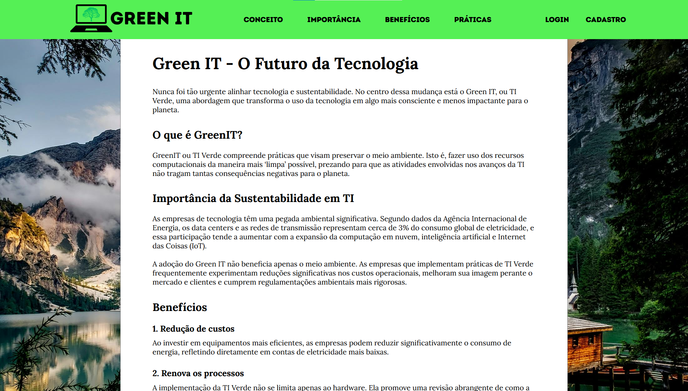
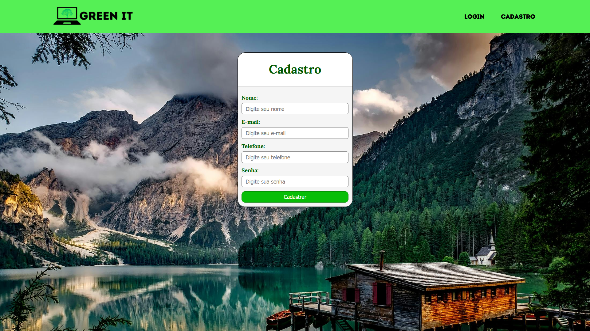

    
  <strong> Artigo sobre TI verde e sustentabilidade - Projeto de Acadêmico </strong>

## 🌳 Introdução 

GreenIT é um site de artigo informativo sobre TI Verde. Nesse projeto, desenvolvi o front-end com foco em design e back-end com CRUD básico de login e cadastro de usuário.

Me preocupei em fazer uma design atraente e disponível para visualização em celulares, tablets e computadores. Além disso, criei um banco de dados e implementei CRUD para validação (login) e adição (cadastro) de usuários. Segue abaixo as principais funcionalidades e seções do site:

- Nav com links da página inicial, login, cadastro e botão de logout (caso usuário esteja logado)
- Página inicial divida em tópicos sobre o tema 
- Funcionalidades de login e cadastro com back-end em PHP
- Responsividade com breakpoints definidos com media queries

## 📷 Imagens

  
  

## 🖥️ Tecnologias

- 
- 
- 
